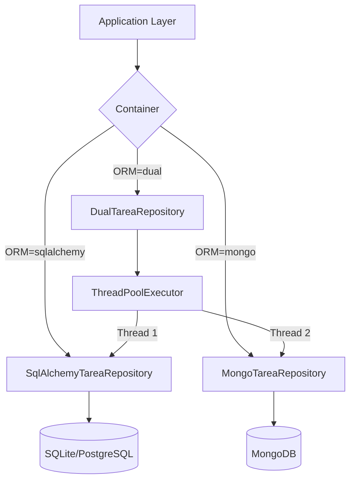
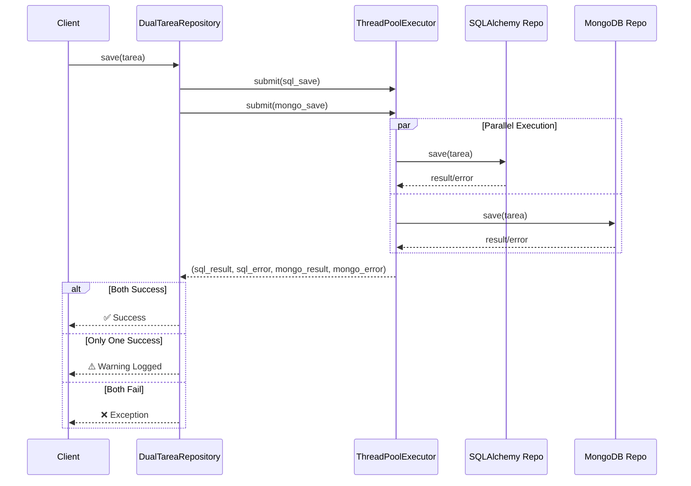
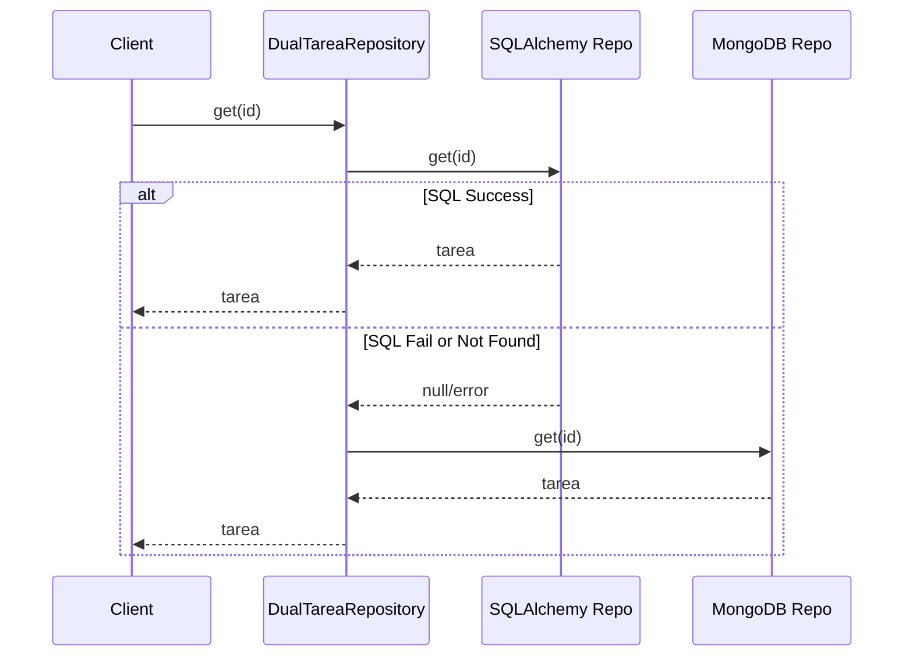
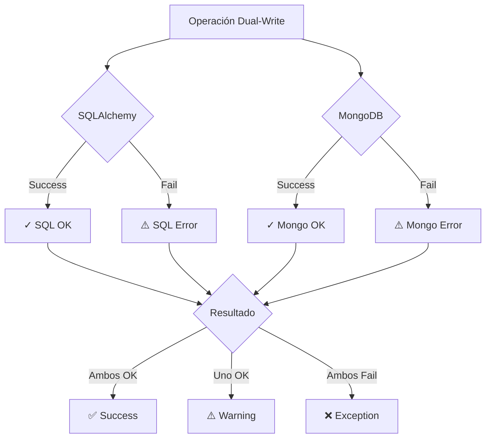

# Modo Dual - Dual-Write/Dual-Read

## 📖 Descripción

El **DualTareaRepository** implementa un patrón de migración sin downtime que permite escribir y leer desde dos bases de datos simultáneamente (SQLAlchemy y MongoDB).

## 🎯 Objetivo

Facilitar la migración de datos entre diferentes sistemas de persistencia sin interrumpir el servicio, siguiendo las mejores prácticas de la arquitectura hexagonal.

---

## 🏗️ Arquitectura

### Diagrama de Componentes



### Patrón de Diseño

El repositorio dual implementa el **patrón Adapter** de la arquitectura hexagonal:

```
┌─────────────────────────────────────────────────────────────┐
│                    Application Layer                         │
│  ┌──────────────┐    ┌──────────────┐    ┌──────────────┐  │
│  │ Use Cases    │───▶│  Repository  │◀───│   Domain     │  │
│  │              │    │   Port       │    │   Models     │  │
│  └──────────────┘    └──────┬───────┘    └──────────────┘  │
└─────────────────────────────┼───────────────────────────────┘
                              │
┌─────────────────────────────┼───────────────────────────────┐
│                   Infrastructure Layer                      │
│  ┌──────────────────────────┴────────────────────────────┐ │
│  │              DualTareaRepository                      │ │
│  │  ┌─────────────────┐      ┌────────────────────────┐ │ │
│  │  │  SQLAlchemy     │      │  MongoDB               │ │ │
│  │  │  Repository     │      │  Repository            │ │ │
│  │  └────────┬────────┘      └───────────┬────────────┘ │ │
│  └───────────┼───────────────────────────┼──────────────┘ │
└──────────────┼───────────────────────────┼────────────────┘
               │                           │
        ┌──────▼──────┐            ┌───────▼────────┐
        │  SQLite/    │            │    MongoDB     │
        │  PostgreSQL │            │                │
        └─────────────┘            └────────────────┘
```

---

## 🚀 Estrategia de Migración

### Fase 1: Dual-Write (Escritura Doble)



**Operaciones:**
- **save()**: Escribe en **ambas** bases de datos EN PARALELO usando `ThreadPoolExecutor`
- **eliminar()**: Elimina de **ambas** bases de datos EN PARALELO

### Fase 2: Dual-Read (Lectura con Fallback)



**Operaciones:**
- **get()**: Lee de SQLAlchemy (principal), con fallback a MongoDB
- **list()**: Lee de SQLAlchemy (principal), con fallback a MongoDB

---

## 📋 Uso

### Activar el Modo Dual

Para habilitar el modo dual, configura la variable de entorno `ORM`:

#### Windows PowerShell:
```powershell
$env:ORM="dual"
uvicorn backend_fastapi.main:app --reload
```

#### Linux/Mac:
```bash
export ORM=dual
uvicorn backend_fastapi.main:app --reload
```

### Desactivar el Modo Dual

#### Volver a SQLAlchemy (por defecto):
```powershell
$env:ORM="sqlalchemy"
# o simplemente no definir ORM
```

#### Usar solo MongoDB:
```powershell
$env:ORM="mongo"
```

---

## 🔍 Características

### ✅ Ejecución Paralela

Las operaciones de escritura se ejecutan en ambas bases de datos simultáneamente usando `ThreadPoolExecutor` con 2 workers:

```python
# Pool de threads global (linea 16)
executor = ThreadPoolExecutor(max_workers=2, thread_name_prefix="DualRepo")

# Uso interno
future_sql = executor.submit(lambda: self._sql_repo.save(tarea))
future_mongo = executor.submit(lambda: self._mongo_repo.save(tarea))
```

### ✅ Tolerancia a Fallos



- Si **una** base de datos falla, la operación continúa con la otra
- Si **ambas** bases de datos fallan, se lanza una excepción
- Los errores se registran con logging detallado

### ✅ Logging Detallado

El repositorio dual incluye emojis y mensajes claros para facilitar el debugging:

```
🔄 Dual-Write iniciado para tarea <uuid>
✓ Operación SQLAlchemy completada
✓ Operación MongoDB completada
✅ Dual-Write exitoso para tarea <uuid>
```

**Niveles de Log:**
- `INFO`: Inicio/completado de operaciones dual
- `WARNING`: Fallo en una de las bases de datos
- `ERROR`: Fallo en ambas bases de datos
- `DEBUG`: Operaciones individuales completadas

---

## 🧪 Testing

Puedes probar el modo dual ejecutando los tests:

```powershell
# Test del repositorio dual
pytest test/test_dual_repository.py -v

# Test de todos los repositorios
pytest test/ -v
```

---

## ⚠️ Consideraciones

### Consistencia Eventual

- Si una base de datos falla temporalmente, los datos pueden quedar inconsistentes
- Se recomienda implementar un proceso de sincronización/reconciliación periódico

### Performance

- El modo dual añade overhead por la ejecución paralela
- Es ideal para migraciones, no como solución permanente
- El tiempo de respuesta es el tiempo del repositorio más lento + overhead del threading

### Transacciones

- Las transacciones NO son atómicas entre ambas bases de datos
- Si necesitas atomicidad completa, considera usar un patrón Saga
- Cada repositorio maneja sus propias transacciones independientemente

---

## 🔧 Configuración Avanzada

### Personalizar el Repositorio Dual

Puedes inyectar instancias personalizadas de los repositorios:

```python
from infrastructure.dual.repository.tarea_repository import DualTareaRepository
from infrastructure.sqlalchemy.repository.tarea_repository import SqlAlchemyTareaRepository
from infrastructure.mongo.repository.tarea_repository import MongoTareaRepository

# Repositorios personalizados
sql_repo = SqlAlchemyTareaRepository()
mongo_repo = MongoTareaRepository()

# Inyección manual
dual_repo = DualTareaRepository(
    sql_repository=sql_repo,
    mongo_repository=mongo_repo
)
```

### Ajustar el ThreadPoolExecutor

El executor se define como variable global en `tarea_repository.py`:

```python
# Linea 16 - Personalizar workers
executor = ThreadPoolExecutor(
    max_workers=2,  # Aumentar si necesitas más concurrencia
    thread_name_prefix="DualRepo"
)
```

---

## 🛠️ Guía para Realizar Cambios

### Estructura de Archivos

```
infrastructure/
└── dual/
    ├── repository/
    │   └── tarea_repository.py    # ← Archivo principal
    └── README.md                   # ← Este archivo
```

### Agregar Nuevos Métodos al Repositorio

Si necesitas agregar nuevos métodos al `TareaRepository` y hacerlos compatibles con el modo dual:

**1. Agregar al Port (Interfaz):**
```python
# core/domain/ports/tarea_repository.py
class TareaRepository(ABC):
    @abstractmethod
    def nuevo_metodo(self, tarea_id: UUID) -> Tarea:
        pass
```

**2. Implementar en Repositorios Base:**
```python
# infrastructure/sqlalchemy/repository/tarea_repository.py
class SqlAlchemyTareaRepository(TareaRepository):
    def nuevo_metodo(self, tarea_id: UUID) -> Tarea:
        # Implementación SQLAlchemy
        pass

# infrastructure/mongo/repository/tarea_repository.py
class MongoTareaRepository(TareaRepository):
    def nuevo_metodo(self, tarea_id: UUID) -> Tarea:
        # Implementación MongoDB
        pass
```

**3. Implementar en DualTareaRepository:**

**Para operaciones de escritura (Dual-Write):**
```python
def nuevo_metodo_write(self, tarea: Tarea) -> None:
    """Operación de escritura dual."""
    logger.info(f"🔄 Nuevo método iniciado para tarea {tarea.id}")
    
    _, sql_error, _, mongo_error = self._execute_parallel(
        lambda: self._sql_repo.nuevo_metodo_write(tarea),
        lambda: self._mongo_repo.nuevo_metodo_write(tarea),
    )
    
    if sql_error and mongo_error:
        raise Exception("Operación falló en ambas bases de datos")
    
    if sql_error:
        logger.warning(f"⚠️ SQLAlchemy falló: {sql_error}")
    elif mongo_error:
        logger.warning(f"⚠️ MongoDB falló: {mongo_error}")
    else:
        logger.info(f"✅ Operación exitosa")
```

**Para operaciones de lectura (Dual-Read):**
```python
def nuevo_metodo_read(self, tarea_id: UUID) -> Tarea | None:
    """Operación de lectura con fallback."""
    logger.debug(f"🔍 Buscando tarea {tarea_id}")
    
    # Intenta leer de SQLAlchemy primero
    try:
        result = self._sql_repo.nuevo_metodo_read(tarea_id)
        if result is not None:
            return result
    except Exception as e:
        logger.warning(f"⚠️ Error en SQLAlchemy: {e}")
    
    # Fallback a MongoDB
    try:
        result = self._mongo_repo.nuevo_metodo_read(tarea_id)
        if result is not None:
            logger.info(f"✓ Obtenido de MongoDB (fallback)")
            return result
    except Exception as e:
        logger.error(f"❌ Error en MongoDB: {e}")
    
    return None
```

### Modificar el Comportamiento del ThreadPool

Para cambiar el número de workers o el comportamiento del executor:

```python
# Linea 16 en tarea_repository.py
# Opción 1: Más workers para mayor concurrencia
executor = ThreadPoolExecutor(max_workers=4, thread_name_prefix="DualRepo")

# Opción 2: Usar ProcessPoolExecutor para operaciones CPU-bound
from concurrent.futures import ProcessPoolExecutor
executor = ProcessPoolExecutor(max_workers=2)
```

### Cambiar la Estrategia de Fallback

Para modificar cuál repositorio es el "primario":

```python
def get(self, tarea_id: UUID) -> Tarea | None:
    # Cambiar el orden de los intentos
    try:
        # Intentar MongoDB primero
        tarea = self._mongo_repo.get(tarea_id)
        if tarea is not None:
            return tarea
    except Exception as e:
        logger.warning(f"⚠️ Error en MongoDB: {e}")
    
    # Fallback a SQLAlchemy
    try:
        tarea = self._sql_repo.get(tarea_id)
        if tarea is not None:
            logger.info(f"✓ Obtenido de SQLAlchemy (fallback)")
            return tarea
    except Exception as e:
        logger.warning(f"⚠️ Error en SQLAlchemy: {e}")
    
    return None
```

### Agregar Métricas/Monitoreo

Para agregar métricas de rendimiento:

```python
import time
from prometheus_client import Counter, Histogram

# Métricas
dual_write_duration = Histogram(
    'dual_write_duration_seconds',
    'Duration of dual-write operations',
    ['repository']
)
dual_write_errors = Counter(
    'dual_write_errors_total',
    'Total errors in dual-write operations',
    ['repository', 'error_type']
)

def save(self, tarea: Tarea) -> None:
    start_time = time.time()
    
    _, sql_error, _, mongo_error = self._execute_parallel(...)
    
    # Registrar métricas
    dual_write_duration.labels(repository='sql').observe(time.time() - start_time)
    dual_write_duration.labels(repository='mongo').observe(time.time() - start_time)
    
    if sql_error:
        dual_write_errors.labels(repository='sql', error_type=type(sql_error).__name__).inc()
    if mongo_error:
        dual_write_errors.labels(repository='mongo', error_type=type(mongo_error).__name__).inc()
```

---

## 🐛 Debugging y Troubleshooting

### Logs no aparecen

Asegúrate de que el logging esté configurado correctamente:

```python
import logging

# Configurar nivel de logging
logging.basicConfig(
    level=logging.DEBUG,  # Cambiar a INFO en producción
    format='%(asctime)s - %(name)s - %(levelname)s - %(message)s'
)
```

### Timeouts en operaciones paralelas

El `ThreadPoolExecutor` no tiene timeout por defecto. Para agregar:

```python
from concurrent.futures import wait, FIRST_COMPLETED

# En _execute_parallel
future_sql = executor.submit(sql_func)
future_mongo = executor.submit(mongo_func)

# Esperar con timeout
done, not_done = wait(
    [future_sql, future_mongo],
    timeout=10.0,  # 10 segundos
    return_when=FIRST_COMPLETED
)

if not_done:
    # Cancelar las que no terminaron
    for future in not_done:
        future.cancel()
```

### Deadlocks

Si hay deadlocks:
1. Verificar que los repositorios base no compartan recursos
2. Asegurar que no haya locks anidados entre SQLAlchemy y MongoDB
3. Considerar usar `asyncio` en lugar de threads si hay mucha I/O

---

## 📚 Referencias

- Ver `roadmap.md` sección 6: "Estrategia de Migración (Dual-Write / Dual-Read)"
- Patrón de Arquitectura Hexagonal: Ports & Adapters
- [Parallel Execution con ThreadPoolExecutor](https://docs.python.org/3/library/concurrent.futures.html)

---

## 🎓 Ejemplo Completo

```python
# 1. Configurar variable de entorno
import os
os.environ["ORM"] = "dual"

# 2. Obtener el caso de uso (automáticamente usará DualTareaRepository)
from infrastructure.container import get_crear_tarea_use_case
from core.application.crear_tarea import CrearTareaCommand
from core.domain.models.tarea import EstadoTarea

use_case = get_crear_tarea_use_case()

# 3. Ejecutar operación - se escribirá en AMBAS bases de datos
cmd = CrearTareaCommand(
    titulo="Tarea de prueba",
    descripcion="Esta tarea se guardará en SQLite Y MongoDB",
    estado=EstadoTarea.PENDIENTE
)

tarea = use_case.execute(cmd)
print(f"Tarea {tarea.id} creada en ambas bases de datos")
```

---

**Última actualización:** 2026-02-10
