# Arquitectura Hexagonal: Core + Infrastructure + FastAPI (usando uv)

**Versión:** 1.0  
**Estado:** Acordado para desarrollo

## 1. Objetivo del documento

Este documento define la arquitectura técnica para el backend del proyecto. El enfoque es **Arquitectura Hexagonal (Ports & Adapters)** concreta para Python, gestionada con **uv**.

### Metas Principales:
1.  **Desacoplamiento Total:** El dominio (Core) no sabe de FastAPI, SQLAlchemy ni Mongo.
2.  **Intercambiabilidad:** Cambiar de ORM o de Framework (p.ej. FastAPI a Flask) no debe reescribir la lógica de negocio.
3.  **Migraciones sin Downtime:** Soportar escritura en dos ORMs simultáneamente durante migraciones de datos.
4.  **Gestión Moderna:** Uso de `uv` y paquetes instalables (`editable`) en lugar de hacks con `sys.path` o múltiples entornos virtuales.

---

## 2. Principios Clave y Regla de Dependencias

La regla de oro (no negociable) es la dirección de las dependencias. El "Core" es el centro del universo y no depende de nadie externo a él.

### Diagrama de Dependencias


### Reglas:
*   **API** $\rightarrow$ Llama a **Casos de Uso**.
*   **Core** $\rightarrow$ Define interfaces (Puertos).
*   **Infraestructura** $\rightarrow$ Implementa los Puertos del Core.
*   **Prohibido:** Importar `SQLAlchemy` o `FastAPI` dentro de la carpeta `core`.

---

## 3. El Core como Módulo Independiente

El Core no es una carpeta cualquiera, es un **paquete Python instalable**. Si mañana quiero reutilizar la lógica de negocio en un worker de Celery o en un CLI, instalo este paquete.

### 3.1 Estructura de Archivos

```mermaid
graph LR
    subgraph CorePackage["📦 core/"]
        direction TB
        pyproj1["pyproject.toml"]
        coremod["core/"]
        
        subgraph CoreInternals[" "]
            direction TB
            dom["domain/"]
            app["application/"]
            
            subgraph Domain["📁 domain/"]
                mod1["models/tarea.py"]
                port1["ports/tarea_repository.py"]
            end
            
            subgraph App["📁 application/"]
                usecase1["crear_tarea.py"]
            end
        end
        
        pyproj1 --- coremod
        coremod --- CoreInternals
    end

    classDef fileStyle fill:#ffffff,stroke:#333,stroke-width:1px;
    classDef folderStyle fill:#e1f5fe,stroke:#0277bd,stroke-width:2px;
    
    class pyproj1,coremod,mod1,port1,usecase1 fileStyle;
    class CorePackage,CoreInternals,Domain,App folderStyle;
```



### 3.2 Definición de Puertos (Contratos)
El puerto define **QUÉ** se necesita, no **CÓMO** se hace.

```python
# core/domain/ports/tarea_repository.py
from abc import ABC, abstractmethod
from core.domain.models.tarea import Tarea

class TareaRepository(ABC):
    @abstractmethod
    def save(self, tarea: Tarea) -> None:
        ...

    @abstractmethod
    def get(self, id: str) -> Tarea | None:
        ...
```

---

Perfecto. Vamos a refinar la capa de **Infraestructura** para que siga un patrón estricto y organizado por responsabilidades: `models` (la representación de la tabla/documento), `session` (la conexión/engine) y `repository` (la implementación del puerto).

Esta separación es crucial para que el código sea limpio y testable.

Aquí tienes la actualización de la sección **4. Infraestructura** y el detalle de la implementación.

---

## 4. Infraestructura como Paquete (Estructura Refinada)

La infraestructura ahora se organiza internamente en tres bloques lógicos para cada tecnología (SQLAlchemy, Mongo, etc.):
1.  **`session/`**: Gestión de la conexión, engine y cliente.
2.  **`models/`**: Definición de esquemas de base de datos (Tablas, Colecciones).
3.  **`repository/`**: Implementación concreta de los puertos del Core.

### 4.1 Nueva Estructura de Archivos

```mermaid
graph TD
    subgraph InfraPackage["📦 infrastructure/"]
        direction TB
        pyproj["pyproject.toml"]
        inframod["infrastructure/"]
        
        subgraph Internals[" "]
            direction TB
            
            subgraph SQL["📂 sqlalchemy/"]
                SQLSession["session/"]
                SQLModel["models/"]
                SQLRepo["repository/"]
            end
            
            subgraph Mongo["📂 mongo/"]
                MongoSession["session/"]
                MongoModel["models/"]
                MongoRepo["repository/"]
            end
            
            subgraph Dual["📂 dual/"]
                DualRepo["repository/"]
            end
            
            Container["container.py"]
        end
        
        pyproj --- inframod
        inframod --- Internals
    end

    classDef fileStyle fill:#ffffff,stroke:#333,stroke-width:1px;
    classDef folderStyle fill:#fff3e0,stroke:#e65100,stroke-width:2px;
    
    class pyproj,inframod,Container fileStyle;
    class InfraPackage,Internals,SQL,Mongo,Dual folderStyle;
```



---

### 4.2 Implementación SQLAlchemy (Ejemplo Práctico)

Esta es la guía de código para la división en `session`, `model` y `repository`.

#### A. Session (`session/db.py`)
Aquí vive la configuración del engine y la gestión de la sesión. Nada de lógica de negocio, solo conexión.

```python
# infrastructure/sqlalchemy/session/db.py
from sqlalchemy import create_engine
from sqlalchemy.orm import sessionmaker, Session

# En un caso real, esto vendría de variables de entorno
DATABASE_URL = "sqlite:///./test.db"

engine = create_engine(DATABASE_URL, connect_args={"check_same_thread": False})
SessionLocal = sessionmaker(autocommit=False, autoflush=False, bind=engine)

def get_db() -> Session:
    """Dependency injection para FastAPI o uso interno."""
    db = SessionLocal()
    try:
        yield db
    finally:
        db.close()
```

#### B. Model (`models/tarea.py`)
Aquí se define cómo se guarda el dato en la base de datos. **Ojo**: Esto no es el modelo del Dominio (`core.domain.models.Tarea`), es el mapa de la tabla.

```python
# infrastructure/sqlalchemy/models/tarea.py
from sqlalchemy import Column, String
from sqlalchemy.orm import declarative_base

Base = declarative_base()

class TareaDB(Base):
    __tablename__ = "tareas"

    id = Column(String, primary_key=True, index=True)
    titulo = Column(String, index=True)
    descripcion = Column(String)

    def to_domain(self):
        """Método helper para convertir a modelo de Dominio"""
        from core.domain.models.tarea import Tarea # Import local para evitar circulars tempranas
        return Tarea(id=self.id, titulo=self.titulo, descripcion=self.descripcion)

    @classmethod
    def from_domain(cls, tarea_domain):
        """Método helper para crear desde modelo de Dominio"""
        return cls(id=tarea_domain.id, titulo=tarea_domain.titulo, descripcion=tarea_domain.descripcion)
```

#### C. Repository (`repository/tarea_repository.py`)
Aquí es donde ocurre la magia: convertimos de `TareaDB` a `Tarea` (Dominio) y viceversa. El Core nunca ve `TareaDB`.

```python
# infrastructure/sqlalchemy/repository/tarea_repository.py
from core.domain.ports.tarea_repository import TareaRepository
from core.domain.models.tarea import Tarea
from infrastructure.sqlalchemy.session.db import SessionLocal
from infrastructure.sqlalchemy.models.tarea import TareaDB

class SqlAlchemyTareaRepository(TareaRepository):
    def __init__(self):
        # En una app real, inyectaríamos la sesión, no la crearíamos aquí
        self.db = SessionLocal()

    def save(self, tarea: Tarea) -> None:
        # 1. Mapeamos Dominio -> Infraestructura
        tarea_db = TareaDB.from_domain(tarea)
        
        self.db.add(tarea_db)
        self.db.commit()
        self.db.refresh(tarea_db)

    def get(self, id: str) -> Tarea | None:
        # 1. Buscamos en Infraestructura
        tarea_db = self.db.query(TareaDB).filter(TareaDB.id == id).first()
        
        if not tarea_db:
            return None
            
        # 2. Mapeamos Infraestructura -> Dominio
        return tarea_db.to_domain()
```

---

### 4.3 Implementación MongoDB (Ejemplo Práctico)

Misma estructura, diferente tecnología.

#### A. Session (`session/client.py`)
```python
# infrastructure/mongo/session/client.py
from motor.motor_asyncio import AsyncIOMotorClient

client = AsyncIOMotorClient("mongodb://localhost:27017")
database = client.mi_proyecto

def get_db():
    return database
```

#### B. Model (`models/tarea.py`)
En Mongo, el "modelo" suele ser un esquema Pydantic o simplemente el dictado de la base de datos. Usaremos Pydantic para validación.

```python
# infrastructure/mongo/models/tarea.py
from pydantic import BaseModel

class TareaMongo(BaseModel):
    id: str
    titulo: str
    descripcion: str
    
    class Config:
        populate_by_name = True

    def to_domain(self):
        from core.domain.models.tarea import Tarea
        return Tarea(id=self.id, titulo=self.titulo, descripcion=self.descripcion)

    @classmethod
    def from_domain(cls, tarea: Tarea):
        return cls(id=tarea.id, titulo=tarea.titulo, descripcion=tarea.descripcion)
```

#### C. Repository (`repository/tarea_repository.py`)
```python
# infrastructure/mongo/repository/tarea_repository.py
from core.domain.ports.tarea_repository import TareaRepository
from core.domain.models.tarea import Tarea
from infrastructure.mongo.session.client import get_db
from infrastructure.mongo.models.tarea import TareaMongo
from bson import ObjectId

class MongoTareaRepository(TareaRepository):
    def __init__(self):
        self.db = get_db()
        self.collection = self.db.tareas

    async def save(self, tarea: Tarea) -> None:
        # Mapeo Dominio -> Mongo
        tarea_doc = TareaMongo.from_domain(tarea).model_dump(by_alias=True)
        
        # Upsert (Insertar o Actualizar si existe)
        await self.collection.update_one(
            {"_id": ObjectId(tarea.id)}, 
            {"$set": tarea_doc}, 
            upsert=True
        )

    async def get(self, id: str) -> Tarea | None:
        # Buscar en Mongo
        doc = await self.collection.find_one({"_id": ObjectId(id)})
        if not doc:
            return None
            
        # Mapeo Mongo -> Dominio
        tarea_mongo = TareaMongo(**doc)
        return tarea_mongo.to_domain()
```

---

### 4.4 Impacto en el Container

Dado que ahora los repositorios pueden necesitar sesiones o clientes, el `container.py` se encarga de pasar esas dependencias (o dejar que los repositorios las obtengan por defecto según la implementación que hayamos hecho arriba).

```python
# infrastructure/container.py
from core.application.crear_tarea import CrearTareaUseCase
# ... imports de repositorios ...

def get_crear_tarea_use_case():
    # El container decide qué repo inyectar al caso de uso
    # Si los repositorios manejan su propia sesión internamente (como en el ejemplo),
    # la inyección es simple:
    
    orm_type = "sqlalchemy" # Podría venir de os.getenv("ORM")
    
    if orm_type == "mongo":
        repo = MongoTareaRepository()
    elif orm_type == "dual":
        repo = DualTareaRepository(
            SqlAlchemyTareaRepository(), 
            MongoTareaRepository()
        )
    else:
        repo = SqlAlchemyTareaRepository()
        
    return CrearTareaUseCase(repository=repo)
```

### ¿Porque dividirlo en esas carpetas?
Al dividir en `model`, `repository` y `session`:
1.  **Session**: Si cambias la URL de la base de datos, vas a un solo archivo.
2.  **Model**: Si añades un campo a la tabla, vas a un solo archivo.
3.  **Repository**: Si cambia la lógica de cómo se guardan los datos (ej. añadir lógica de 'soft-delete'), vas a un solo archivo sin ensuciar el modelo o la sesión.
---

## 5. Composition Root / Container

El `container.py` es el cerebro de la conexión. Es el **único lugar** donde se decide qué implementación se usa. Aquí inyectamos las dependencias.

### Diagrama de Inyección de Dependencias

```mermaid
graph TD
    subgraph ContainerLogic["📦 infrastructure/container.py"]
        EnvVar["ORM = 'mongo'"]
        
        Factory{¿Qué ORM?}
        
        Factory -->|sqlalchemy| SQLRepo[(SQLAlchemy Repo)]
        Factory -->|mongo| MongoRepo[(Mongo Repo)]
        Factory -->|dual| DualRepo[(Dual Repo)]
        
        DualRepo -->|usa| SQLRepo
        DualRepo -->|usa| MongoRepo
        
        Result[Instancia de TareaRepository]
    end

    EnvVar --> Factory
    SQLRepo --> Result
    MongoRepo --> Result
    DualRepo --> Result

    classDef logicStyle fill:#fce4ec,stroke:#880e4f,stroke-width:2px;
    class Factory,EnvVar,Result logicStyle;
```



---

## 6. Estrategia de Migración (Dual-Write / Dual-Read)

Para migrar datos sin parar el servicio, usamos un repositorio "Dual".

### Flujo de Migración


La API y el Core nunca saben que se está escribiendo en dos bases de datos.

---

## 7. FastAPI como Adaptador de Entrada

La API es una "piel" fina. Solo recibe peticiones HTTP y delega en los casos de uso del Core.

### 7.1 Estructura

```mermaid
graph LR
    subgraph APIPackage["📦 backend_fastapi/"]
        pyproj3["pyproject.toml"]
        apimod["backend_fastapi/"]
        
        subgraph APIInternals[" "]
            main["main.py"]
            routes["api/routes/tareas.py"]
            deps["api/deps.py"]
        end
        
        pyproj3 --- apimod
        apimod --- APIInternals
    end

    classDef fileStyle fill:#ffffff,stroke:#333,stroke-width:1px;
    classDef folderStyle fill:#f3e5f5,stroke:#4a148c,stroke-width:2px;

    class pyproj3,apimod,main,routes,deps fileStyle;
    class APIPackage,APIInternals folderStyle;
```



### 7.2 Conexión Limpia
FastAPI **NO** importa SQLAlchemy. Importa el contenedor de infraestructura.

```python
# backend_fastapi/api/routes/tareas.py
from fastapi import APIRouter, Depends
from infrastructure.container import get_crear_tarea_use_case
# ❌ from infrastructure.sqlalchemy import session  <- PROHIBIDO

router = APIRouter()

@router.post("/tareas")
def create_tarea(cmd, use_case = Depends(get_crear_tarea_use_case)):
    return use_case.execute(cmd)
```

---

## 8. Gestión del Entorno con `uv`

Evitamos el caos de múltiples `.venv`. Usamos **un solo entorno virtual** en la raíz, donde instalamos los paquetes locales en modo *editable*.

### 8.1 Estructura del Monorepo

```mermaid
graph TD
    Root["📂 /project_root"]
    
    subgraph Workspace[" "]
        CoreDir["📂 core/"]
        InfraDir["📂 infrastructure/"]
        APIDir["📂 backend_fastapi/"]
        Venv["📂 .venv/"]
        Lock["uv.lock"]
    end
    
    Root --- Workspace

    classDef rootStyle fill:#37474f,stroke:#fff,stroke-width:2px,color:#fff;
    classDef dirStyle fill:#eceff1,stroke:#000,stroke-width:1px;
    
    class Root rootStyle;
    class CoreDir,InfraDir,APIDir,Venv,Lock dirStyle;
```



### 8.2 Comandos de Configuración

Ejecutar en la terminal desde la raíz del proyecto:

```bash
# 1. Crear el entorno virtual (una sola vez)
uv venv .venv
source .venv/bin/activate  # En Windows: .venv\Scripts\activate

# 2. Instalar los paquetes locales en modo editable
# Esto permite hacer 'from core...' en cualquier parte
uv pip install -e ./core
uv pip install -e ./infrastructure
uv pip install -e ./backend_fastapi

# 3. Instalar dependencias de terceros (FastAPI, SQLAlchemy, etc.)
# Nota: Esto se suele manejar via pyproject.toml root o explícitamente
uv pip install fastapi uvicorn sqlalchemy pymongo
```

### 8.3 Arranque

```bash
uvicorn backend_fastapi.main:app --reload
```

---

## 9. Múltiples Backends (Escalabilidad Arquitectónica)

La belleza de este diseño es que `infrastructure` y `core` pueden ser reutilizados.


---

## 10. Checklist de "Qué NO Hacer"

Para mantener la arquitectura sólida:

| ❌ Prohibido | ✅ En su lugar |
| :--- | :--- |
| Un `.venv` por carpeta (core, infra, api). | Un solo `.venv` en la raíz. |
| Usar `sys.path.append('../..')`. | Instalar paquetes con `uv pip install -e .`. |
| Importar `SQLAlchemy` en `main.py` de la API. | Usar `container.py` para obtener repositorios. |
| Lógica `if mongo: ...` dentro de los Casos de Uso. | Lógica de selección solo en `container.py`. |
| Modelos de dominio que heredan de SQLAlchemy. | Modelos POPO (Plain Old Python Objects) en el Core. |

---

## 11. Conclusión

Esta arquitectura transforma el backend de un "script monolítico" a un conjunto de módulos desacoplados.

1.  **Core:** Producto puro de lógica de negocio.
2.  **Infrastructure:** Plugin de persistencia intercambiable.
3.  **FastAPI:** Mecanismo de entrega.

> **Regla Final:** Los entornos virtuales sirven para **ejecutar**. Los paquetes y los contratos (Puertos) sirven para **diseñar**. Si se respeta esto, el código es escalable y mantenible.